<p align="center">
  
</p>

<h1 align="center">Longevity OS 太医院</h1>
<p align="center"><b>Agentic Longevity OS</b></p>

<p align="center">
A scientifically rigorous health optimization platform<br/>
modeled after the historical Imperial Medical Academy.<br/><br/>
10 specialized AI agents · statistical modeling engine · imperial-themed dashboard
</p>

<p align="center">
All data stays local. No cloud.
</p>

<p align="center">
  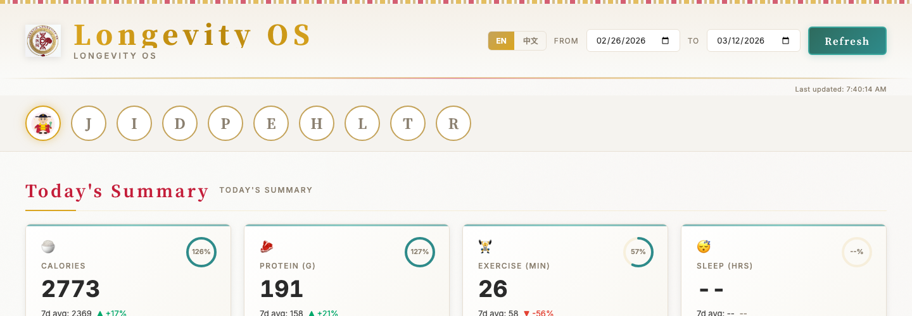
</p>

---

## Architecture

Longevity OS uses a **multi-agent orchestration pattern** inspired by the Imperial Medical Academy's departmental structure. The Imperial Physician orchestrator dispatches work to 9 specialized sub-agents, each with domain-specific knowledge and constraints.

<p align="center">
  
</p>

### Agent Dispatch Flow

When a user makes a request, the orchestrator classifies intent, dispatches to the appropriate department agent(s), collects structured results, and responds. For N-of-1 trials, a two-agent adversarial review process ensures safety and scientific rigor.

<p align="center">
  
</p>

### The Imperial Court

<table>
<tr>
<td align="center" width="20%"><br/><b>Imperial Physician</b><br/>Orchestrator</td>
<td align="center" width="20%"><br/><b>Diet Physician</b><br/>Nutrition</td>
<td align="center" width="20%"><br/><b>Movement Master</b><br/>Exercise</td>
<td align="center" width="20%"><br/><b>Pulse Reader</b><br/>Body Metrics</td>
<td align="center" width="20%"><br/><b>Formula Tester</b><br/>Biomarkers</td>
</tr>
<tr>
<td align="center"><br/><b>Herbalist</b><br/>Supplements</td>
<td align="center"><br/><b>Trial Monitor</b><br/>Experiments</td>
<td align="center"><br/><b>Court Magistrate</b><br/>Trial Design</td>
<td align="center"><br/><b>Medical Censor</b><br/>Safety Review</td>
<td align="center"><br/><b>Court Scribe</b><br/>Reports</td>
</tr>
</table>

---

## Dashboard

The dashboard is a zero-dependency local HTML file served by a Python stdlib HTTP server. Imperial Chinese aesthetic with dark wood panels, gold accents, and teal data visualizations.

### Today's Summary

Four summary cards showing calories, protein, exercise minutes, and sleep hours with 7-day averages and sparklines.

<p align="center">
  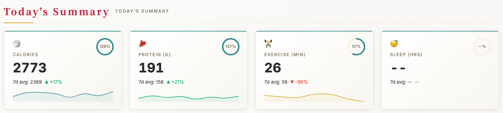
</p>

### Nutrition

Stacked bar chart of daily macronutrient breakdown (protein, carbs, fat) with interactive meal log.

<p align="center">
  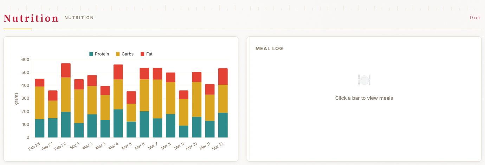
</p>

### Body Metrics

Time series charts for weight, heart rate, HRV, sleep, and blood pressure with 7-day moving averages and anomaly detection.

<p align="center">
  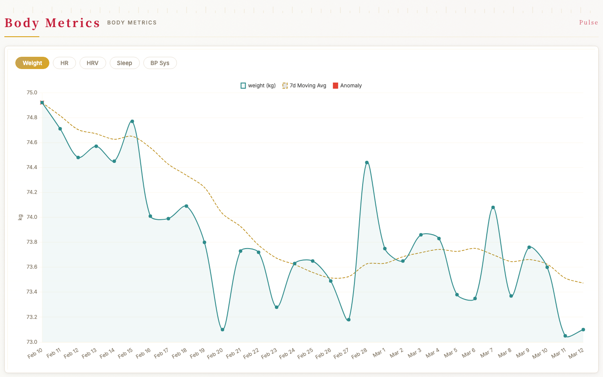
</p>

### Exercise

Activity heatmap (GitHub-style) and recent workout log with duration, distance, heart rate, and RPE.

<p align="center">
  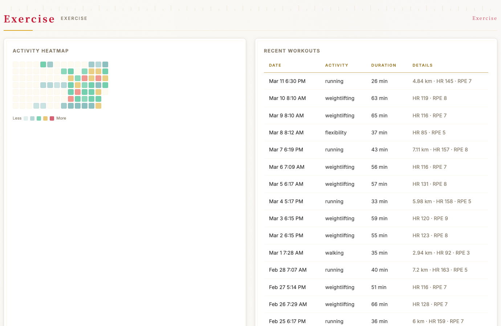
</p>

### Supplement Stack

Current supplement stack with dosage, frequency, timing, and days active.

<p align="center">
  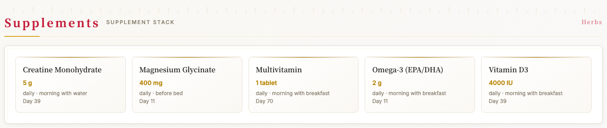
</p>

### Biomarker Trends

Lab result time series with reference ranges for HbA1c, LDL, HDL, CRP, glucose, triglycerides, TSH, and Vitamin D.

<p align="center">
  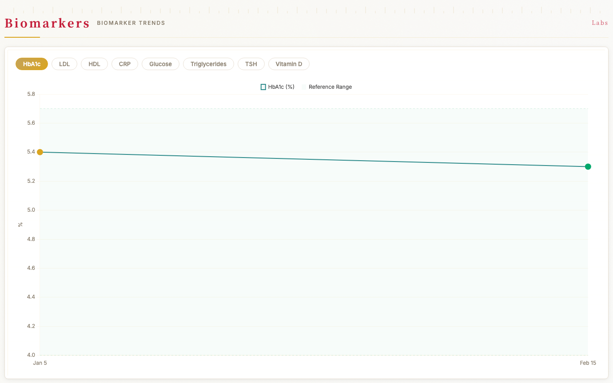
</p>

### Active Trials

N-of-1 trial progress tracking with phase indicators (baseline, intervention, washout) and completion percentage.

<p align="center">
  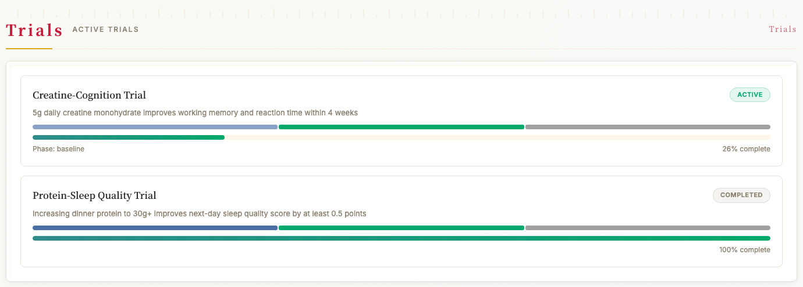
</p>

### Modeling Engine Insights

AI-generated insights with confidence levels, effect sizes, and color-coded severity (anomaly, correlation, trend, recommendation, routine).

<p align="center">
  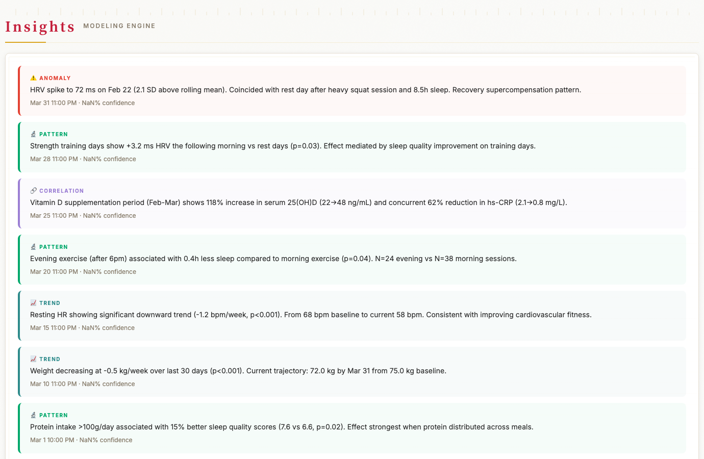
</p>

---

## Quick Start

```bash
# 1. Initialize the database
cd ~/Desktop/Projects/2026/longevity-os
python scripts/setup.py

# 2. Start the dashboard server
python dashboard/server.py

# 3. Open http://localhost:8420
```

The primary interface is voice/text through Claude Code using the `/longevity` or `/taiyiyuan` skill. The dashboard is a read-only visualization layer.

---

## Usage Examples

**Log a meal:**
> "Had grilled salmon with brown rice and broccoli for lunch"

**Log exercise:**
> "Ran 5K in 28 minutes, felt good"

**Log a metric:**
> "Weight 72.1 kg this morning"

**Check status:**
> "Daily summary" or "How's my protein this week?"

**Start a trial:**
> "Propose an experiment" — the system detects patterns, designs an N-of-1 trial, runs adversarial safety review, and presents for approval.

---

## Modules

| Module | Role |
|--------|------|
| Diet | Meal logging, USDA nutrition lookup, recipe library |
| Exercise | Workout logging, volume tracking, activity heatmaps |
| Body Metrics | Weight, blood pressure, sleep, HRV, custom metrics |
| Biomarkers | Lab results with clinical and optimal reference ranges |
| Supplements | Supplement stack, interaction checking, compliance |
| Trials | N-of-1 trial monitoring and analysis |
| Trial Design | Evidence-based trial protocol design |
| Safety Review | Independent adversarial review of trial proposals |
| Reports | Daily digests, weekly reports, trend summaries |

### Modeling Engine

The statistical modeling engine runs behind all modules:

- **Rolling statistics**: 7d, 30d, 90d averages for all tracked metrics
- **Anomaly detection**: Flags values >2 SD from rolling mean
- **Trend analysis**: Linear regression over 30d/90d windows
- **Cross-module correlations**: Pairwise analysis with lag (up to 7 days) and Benjamini-Hochberg correction
- **Causal inference**: Interrupted time series analysis, Bayesian structural time series with custom Kalman filter
- **Power analysis**: Estimates minimum detectable effect size given within-person variance

---

## File Structure

```
longevity-os/
├── SKILL.md                          # Orchestrator (main entry point)
├── agents/                           # Department agent system prompts
│   ├── shiyi.md                      # Diet
│   ├── daoyin.md                     # Exercise
│   ├── zhenmai.md                    # Body Metrics
│   ├── yanfang.md                    # Biomarkers
│   ├── bencao.md                     # Supplements
│   ├── shixiao.md                    # Trial Monitoring
│   ├── yuanpan.md                    # Trial Design
│   ├── yizheng.md                    # Safety Review
│   └── baogao.md                     # Reports
├── dashboard/
│   ├── dashboard.html                # Imperial-themed single-file dashboard
│   └── server.py                     # Python stdlib HTTP server (8 API endpoints)
├── data/
│   ├── schema.sql                    # SQLite schema (17 tables, 25+ indexes)
│   ├── db.py                         # Database interface (TaiYiYuanDB class)
│   ├── nutrition_api.py              # USDA + Open Food Facts nutrition lookup
│   └── migrations/
│       └── 001_init.sql              # Initial schema migration
├── modeling/
│   ├── engine.py                     # Core statistical engine
│   ├── patterns.py                   # Pattern detection & correlation scanner
│   └── causal.py                     # Causal inference (ITS, Bayesian STS)
├── scripts/
│   ├── setup.py                      # Database & directory initialization
│   ├── migrate.py                    # Schema migration runner
│   ├── backup.py                     # Automated backup (30 daily + 12 monthly)
│   ├── export.py                     # JSON/CSV data export
│   ├── import_labs.py                # Lab report parser (~150 marker aliases)
│   └── import_apple_health.py        # Apple Health XML importer
└── docs/
    ├── architecture.svg              # System architecture diagram
    ├── agent-flow.svg                # Agent dispatch flow diagram
    ├── characters/                   # Chibi imperial character illustrations
    └── screenshots/                  # Dashboard screenshots
```

---

## Data Privacy

All health data is stored in a local SQLite database (`taiyiyuan.db`) with file permissions restricted to the owner (`0600`). No data is transmitted to external services. Nutrition lookups use only ingredient names (never personal health context). The dashboard server binds to `127.0.0.1` only and is not accessible from other machines.

---

## Tech Stack

- **AI**: Claude Code multi-agent skill system (10 agents)
- **Database**: SQLite with WAL journal mode
- **Server**: Python stdlib HTTP server (zero dependencies)
- **Dashboard**: Single HTML file, Chart.js 4.x
- **Modeling**: Python (scipy, statsmodels, numpy, pandas)
- **Nutrition API**: USDA FoodData Central + Open Food Facts

---

<p align="center">
  📖 <a href="README.zh.md">中文文档 / Chinese Documentation</a>
</p>
